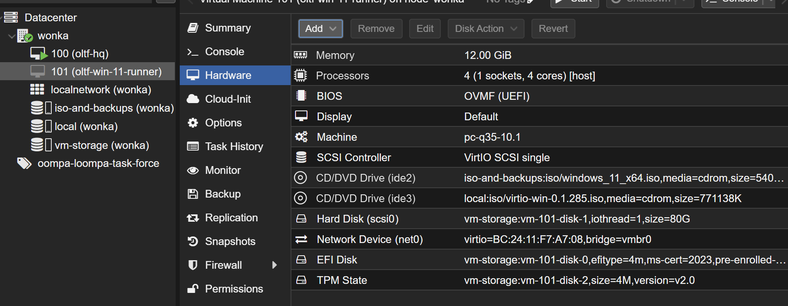
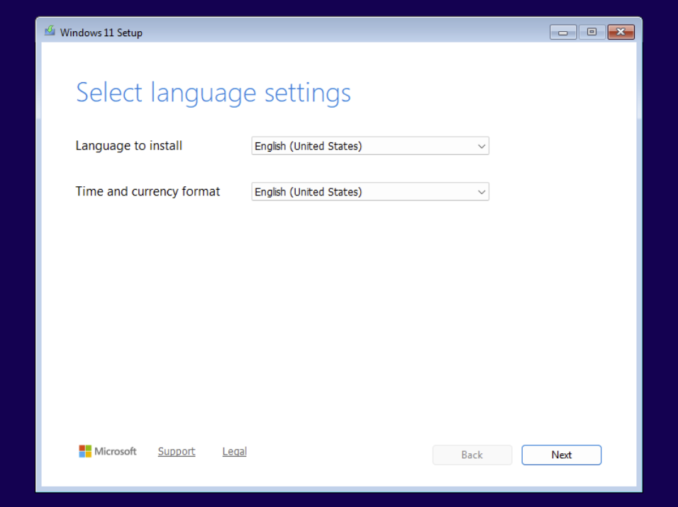
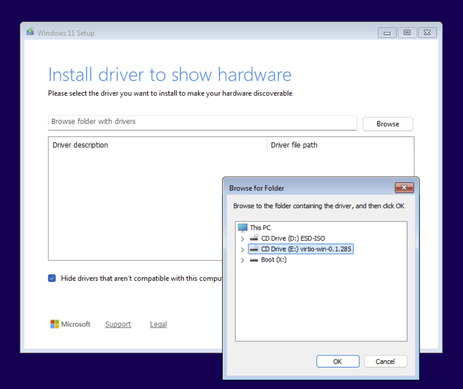
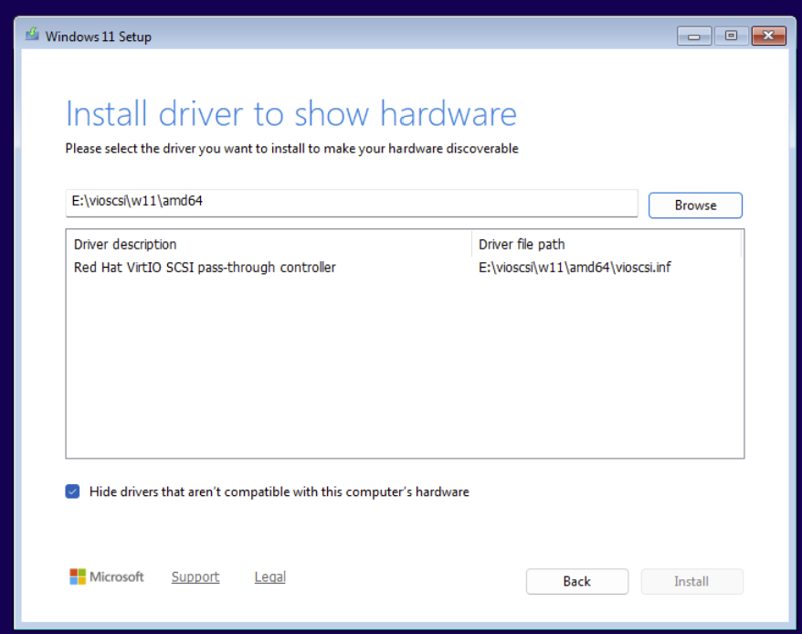
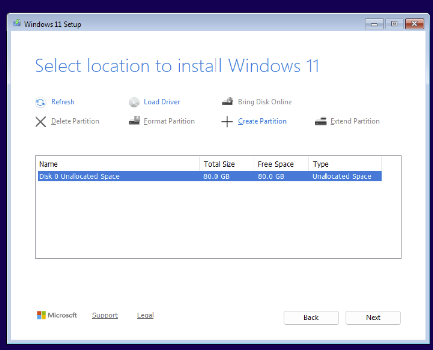
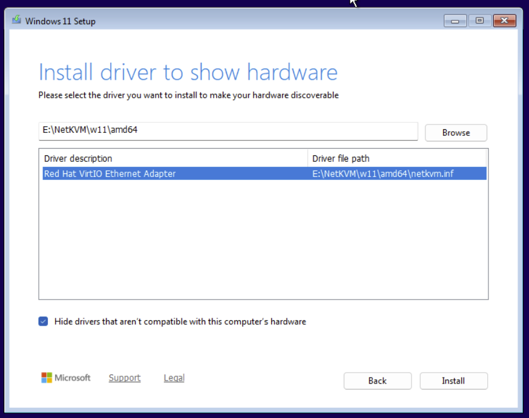
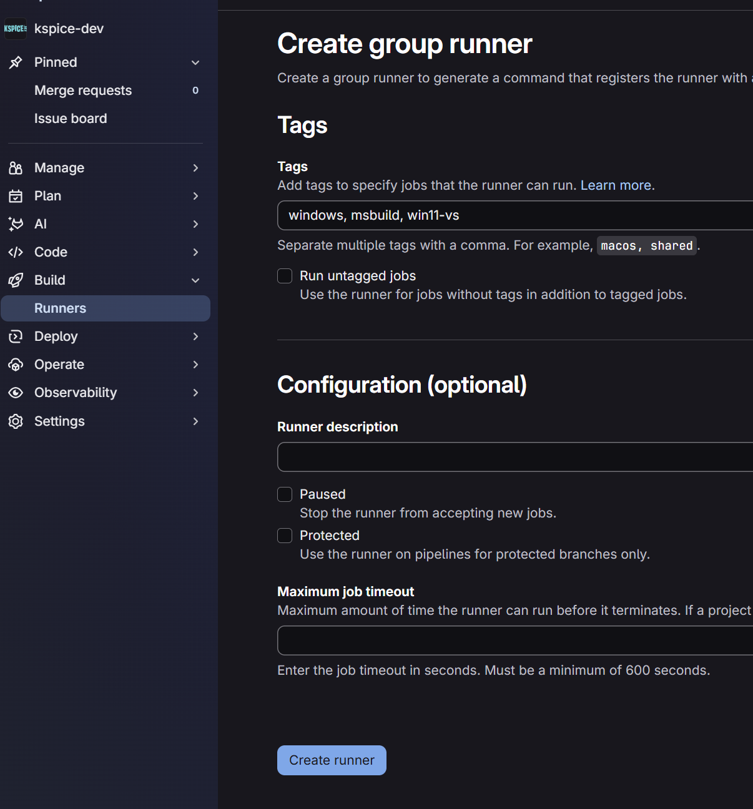
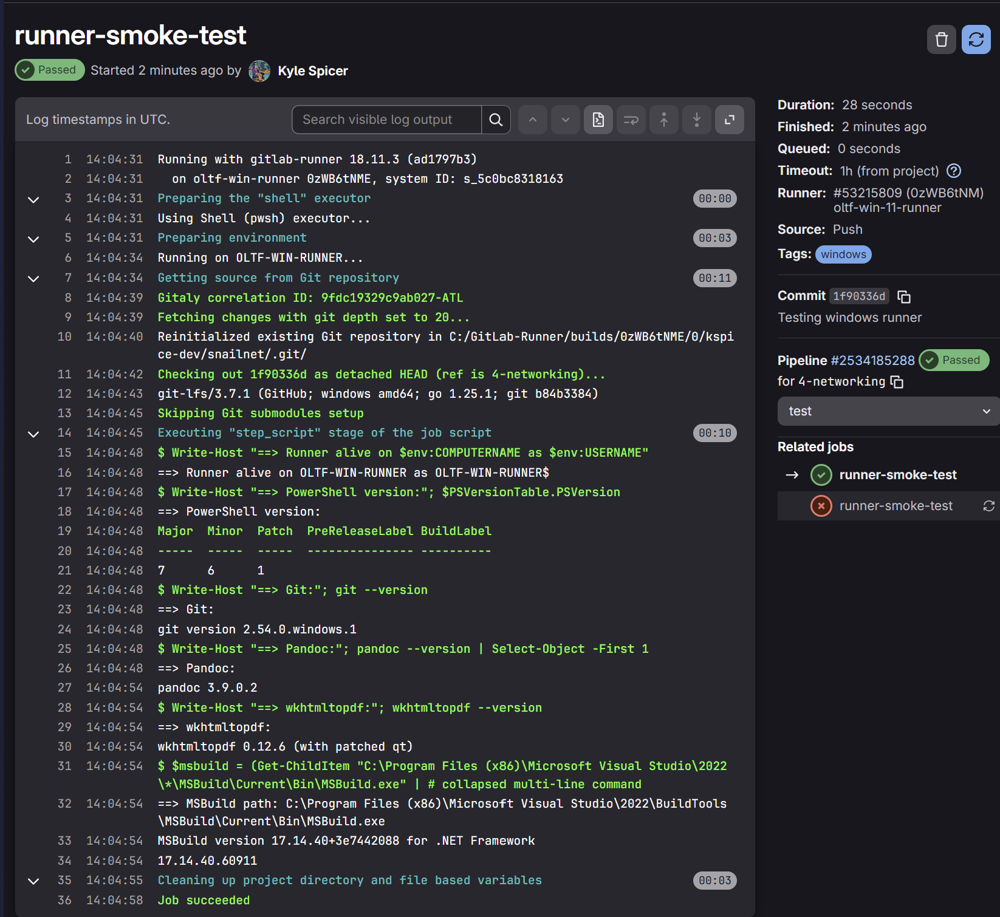
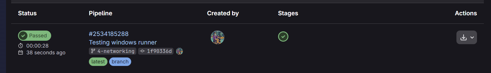

## Table of Contents

1. [Overview](#overview)
1. [Phase 1: Installing the Windows 11 VM on Proxmox](#phase-1-installing-the-windows-11-vm-on-proxmox)
    1. [Download ISOs and Upload to Proxmox](#download-isos-and-upload-to-proxmox)
    1. [Create the Windows 11 VM](#create-the-windows-11-vm)
    1. [Attach the virtio ISO as a Second CD](#attach-the-virtio-iso-as-a-second-cd)
    1. [Boot and Watch for "Press any key" Prompt](#boot-and-watch-for-press-any-key-prompt)
    1. [Install with Your Preferred Settings](#install-with-your-preferred-settings)
    1. [Load the virtio Storage Driver](#load-the-virtio-storage-driver)
    1. [Load the Network Driver](#load-the-network-driver)
    1. [Complete the Installation](#complete-the-installation)
1. [Phase 2: Windows 11 Installation](#phase-2-windows-11-installation)
1. [Phase 3: Toolchain Setup](#phase-3-toolchain-setup)
    1. [Installer PowerShell Script](#installer-powershell-script)
    1. [Verification PowerShell Script](#verification-powershell-script)
1. [Phase 4: GitLab Runner Setup](#phase-4-gitlab-runner-setup)
    1. [GitLab Runner Installer Script](#gitlab-runner-installer-script)
    1. [Expected Results](#expected-results)
1. [Phase 5: GitLab CI/CD Pipeline](#phase-5-gitlab-cicd-pipeline)
    1. [Create Group Runner](#create-group-runner)
    1. [Register Runner](#register-runner)
    1. [Run the Registered Pipeline](#run-the-registered-pipeline)
1. [References](#references)

## Overview

This writeup documents how I set up a self-hosted **GitLab Runner** on a Windows 11 virtual machine running in Proxmox. The goal is a dedicated Windows build environment that can compile and package Windows projects using **MSBuild** for builds and the **GitLab Package Registry** for releases without relying on shared runners or Docker-based Windows containers.
<br>
<br>
This VM is part of the `Oompa Loompa Task Force (OLTF)` Proxmox Resource Pool (see the Wonka homelab theme described in the [Ubuntu Server + Docker + Arcane](./ubuntu-docker-arcane) post). The runner VM is named `oltf-win11-runner`.
<br>
<br>
By the end of this writeup, I'll have:
  - A Windows 11 VM running on Proxmox with virtio drivers
  - Visual Studio Build Tools 2022, PowerShell 7, Git, and pandoc installed
  - A GitLab Runner registered as a Windows service using the PowerShell executor
  - A `.gitlab-ci.yml` that builds, packages, and publishes releases automatically

## Phase 1: Installing the Windows 11 VM on Proxmox

### Download ISOs and Upload to Proxmox

1. Download the latest `Windows 11 ISO` [HERE](https://www.microsoft.com/software-download/windows11). This will be the virtual machine that builds and packages our Windows projects.
2. Download the `virtio-win ISO` [HERE](https://fedorapeople.org/groups/virt/virtio-win/direct-downloads/stable-virtio/virtio-win.iso). This is what lets Windows see the virtual SCSI disk and network during install.
3. Upload both ISOs to Proxmox host.

### Create the Windows 11 VM

Click `Create VM` in Proxmox. Below are the exact settings I used:

```
General:
  Node: wonka (my host)
  Name: oltf-win11-runner

OS:
  ISO Image: the Windows 11 vm .iso
  Type: Microsoft Windows
  Version: 11/2022/2025

System:
  Graphic Card: Default
  Machine: q35
  BIOS: OVMF (UEFI)
  Add EFI Disk: checked, storage local-lvm (or wherever)
  Pre-enroll keys: checked
  Add TPM: checked, storage vm-storage (personal setup), version v2.0
  SCSI Controller: VirtIO SCSI single
  Qemu Agent: checked

Disks:
  Bus/Device: SCSI 0
  Storage: vm-storage
  Disk size (GiB): 80 (VS Build Tools alone eats about 20 GB)
  Cache: Default

CPU:
  Sockets: 1
  Cores: 4
  Type: host

Memory:
  Memory (MiB): 12288 (12 GB recommended)

Network:
  Bridge: vmbr0
  Model: VirtIO (paravirtualized)
  Firewall: unchecked

Confirm:
  - DO NOT select "Start after created" yet — need to attach the virtio ISO first.

Click Finish
```

### Attach the virtio ISO as a Second CD

Select the newly created Windows 11 VM in the sidebar, then open the `Hardware` tab.

1. Click `Add -> CD/DVD Drive`
2. Storage: `local`
3. ISO Image: `virtio-win.iso`
4. BUS: `IDE`
5. Device: 3

You should now have two CDs: `Win 11` (boot) and `virtio` (for drivers during install).

*Visual of my exact configuration*


### Boot and Watch for "Press any key" Prompt

1. Start the Windows 11 VM and hit `Enter` when the "Press any key" prompt is displayed.
2. You will see the Windows 11 setup screen with the language options.



### Install with Your Preferred Settings

Select your language and click `Next`, then `Install Now`.

When prompted for a product key, select `I do not have a product key`.

Select `Windows 11 Pro` as the edition.

### Load the virtio Storage Driver

Windows won't see the virtual SCSI disk without this driver. Click `Load Driver` on the disk selection screen, then:

1. Click `Browse` to open the file picker
2. Select the virtio ISO
3. Drill down into: `vioscsi -> w11 -> amd64`
4. The dialog box should show `RedHat VirtIO SCSI`
5. Select it and click `Install`

*Selecting the virtio ISO*


*virtio ISO properly selected*


Drive 0 will now appear in the disk list.



### Load the Network Driver

1. Click `Load driver` again -> `Browse`
2. Navigate to `NetKVM -> w11 -> amd64` -> `OK`
3. Select `Red Hat VirtIO Ethernet Adapter` -> `Install`



### Complete the Installation

1. Select `Drive 0 Unallocated Space` -> `Next` to begin the installation.
2. After reboot, select your country of origin and keyboard layout, then click `Next`.
3. Name your device. (I used `oltf-win-runner`), it will reboot again.
4. When asked how you'd like to set up the device, select `Personal` -> `Next`.

## Phase 2: Windows 11 Installation

This phase will include everything after I landed on the Windows 11 Pro VM Desktop. I took a snapshot before, just incase I goof something up.

1. Restarted and performed required updates.
1. Enabled `RemoteDesktop` features.
  - `System > Advanced > Remote Desktop > Enable Remote Desktop`
1. Installed **OpenSSH Server**
  - `Add-WindowsCapability -Online -Name OpenSSH.Server~~~~0.0.1.0`
  - PLEASE NOTE: This didn't work before the updates.
1. Start the **sshd** service
  - `Start-Service sshd -Verbose`
1. Verify **sshd** is Running
  - `Get-Service sshd` 
  - NOTE: If you run into issues, this PowerShell script helped me out.
  
  ```ps1
  # Force network to Private (so default SSH rule applies)
  Set-NetConnectionProfile `
    -InterfaceAlias (Get-NetAdapter | Where-Object Status -eq 'Up').Name `
    -NetworkCategory Private

  # Make sure there's a permissive rule for port 22 on all profiles
  Get-NetFirewallRule -Name 'OpenSSH-Server-In-TCP' -ErrorAction SilentlyContinue |
    Remove-NetFirewallRule

  New-NetFirewallRule -Name 'OpenSSH-Server-In-TCP' `
    -DisplayName 'OpenSSH Server (sshd)' `
    -Enabled True -Direction Inbound -Protocol TCP -Action Allow `
    -LocalPort 22 -Profile Any

  Restart-Service sshd
  
  # ssh should be working now
  ```
1. I added chrome as the browser, shutdown, and took a snapshot here.

## Phase 3: Toolchain Setup

This phase sets up the complete Windows build and document generation toolchain. The installer script automatically downloads and installs the latest versions of **PowerShell 7**, **Git for Windows**, **Pandoc**, **wkhtmltopdf**, and **Visual Studio Build Tools 2022** with the required C++ and MSBuild components. After installation, the verification script confirms that each dependency was installed correctly and is available from the command line.

### Installer PowerShell Script
```powershell
# Set $dl to the per-user TEMP directory plus an "installers" folder.
# We will drop every downloaded installer in here.
$dl = "$env:TEMP\installers"

# Create that directory if it doesn't exist.
New-Item -ItemType Directory -Force -Path $dl | Out-Null

# Stop Invoke-WebRequest from drawing its progress bar.
$ProgressPreference = 'SilentlyContinue'

Write-Host "==> PowerShell 7"

# Hit GitHub's API for the latest PowerShell release and pull its asset list.
# Invoke-RestMethod auto-parses the JSON into PowerShell objects, so .assets
# gives us an array of file metadata for that release.
$pwshUrl = (Invoke-RestMethod "https://api.github.com/repos/PowerShell/PowerShell/releases/latest").assets |
    Where-Object name -Match 'win-x64\.msi$' | Select-Object -First 1 -ExpandProperty browser_download_url

# Download the MSI to $dl\pwsh.msi.
Invoke-WebRequest $pwshUrl -OutFile "$dl\pwsh.msi"

# Run msiexec to install the MSI silently and block until it finishes.
Start-Process msiexec.exe -Wait -ArgumentList "/i `"$dl\pwsh.msi`" /quiet /qn ADD_PATH=1"

Write-Host "==> Git for Windows"

# Look at the latest git-for-windows release; filter to the 64-bit installer.
# Git's installer is a .exe (Inno Setup), not an MSI.
$gitUrl = (Invoke-RestMethod "https://api.github.com/repos/git-for-windows/git/releases/latest").assets |
    Where-Object name -Match '64-bit\.exe$' | Select-Object -First 1 -ExpandProperty browser_download_url

# Download the installer.
Invoke-WebRequest $gitUrl -OutFile "$dl\git.exe"

# Run the Inno Setup installer with its silent flags:
Start-Process "$dl\git.exe" -Wait -ArgumentList "/VERYSILENT /NORESTART /NOCANCEL /SP- /CLOSEAPPLICATIONS /RESTARTAPPLICATIONS"

Write-Host "==> Pandoc"

# Match the Windows x86_64 MSI from the latest pandoc release.
$pandocUrl = (Invoke-RestMethod "https://api.github.com/repos/jgm/pandoc/releases/latest").assets |
    Where-Object name -Match 'windows-x86_64\.msi$' | Select-Object -First 1 -ExpandProperty browser_download_url

# Download
Invoke-WebRequest $pandocUrl -OutFile "$dl\pandoc.msi"

# Silent MSI install. Pandoc's installer adds itself to PATH by default,
# so we don't need ADD_PATH like we did for PowerShell.
Start-Process msiexec.exe -Wait -ArgumentList "/i `"$dl\pandoc.msi`" /quiet /qn"

Write-Host "==> wkhtmltopdf"

# wkhtmltopdf 0.12.6-1 is the last "stable" release
Invoke-WebRequest "https://github.com/wkhtmltopdf/packaging/releases/download/0.12.6-1/wkhtmltox-0.12.6-1.msvc2015-win64.exe" `
    -OutFile "$dl\wkhtmltopdf.exe"

Start-Process "$dl\wkhtmltopdf.exe" -Wait -ArgumentList "/S"

# --- Visual Studio Build Tools 2022 --- the heavy one ---
Write-Host "==> Visual Studio Build Tools 2022 (this is the long one)"

# aka.ms/vs/17/release/vs_BuildTools.exe is Microsoft's permalink for the
# current Visual Studio 2022 (version 17.x) Build Tools bootstrapper.
# The bootstrapper is tiny (~3 MB); it downloads the actual ~10 GB of
# workloads on demand based on the --add flags we pass.
Invoke-WebRequest "https://aka.ms/vs/17/release/vs_BuildTools.exe" -OutFile "$dl\vs_buildtools.exe"

# Run the bootstrapper. The -ArgumentList here is a PowerShell array, which
# is the correct way to pass complex args (each element becomes one argv
# token, no quoting headaches).
#
#   --quiet         => no UI
#   --wait          => return only when the install is fully finished
#                      (without this, the bootstrapper exits while a child
#                       installer process keeps running in the background)
#   --norestart     => don't reboot at the end
#   --nocache       => don't keep the ~10 GB of downloaded payload after
#                      install completes; saves disk
#   --add <id>      => include a workload or component. We include:
#       VCTools                       — the C++ compiler, linker, libs
#       MSBuildTools                  — MSBuild itself
#       Windows11SDK.22621            — Windows 11 SDK (headers, libs)
#   --includeRecommended => pull in the recommended components for the
#                          workloads we asked for (e.g. ATL, MFC support)
Start-Process "$dl\vs_buildtools.exe" -Wait -ArgumentList @(
    "--quiet","--wait","--norestart","--nocache",
    "--add","Microsoft.VisualStudio.Workload.VCTools",
    "--add","Microsoft.VisualStudio.Workload.MSBuildTools",
    "--add","Microsoft.VisualStudio.Component.Windows11SDK.22621",
    "--includeRecommended"
)

# Final note + 10 second pause so you can read it before SSH disconnects.
Write-Host "==> Done. Rebooting in 10 seconds. Reconnect with: ssh runner@10.0.0.30"
Start-Sleep -Seconds 10
Restart-Computer -Force
```

### Verification PowerShell Script

```powershell
git --version
pandoc --version | Select-Object -First 1
wkhtmltopdf --version
pwsh --version
(Get-ChildItem "C:\Program Files (x86)\Microsoft Visual Studio\2022\*\MSBuild\Current\Bin\MSBuild.exe" | Select-Object -First 1).FullName
```

**PLEASE NOTE:** Your output should be similar to this:

```powershell
git version 2.54.0.windows.1
pandoc 3.9.0.2
wkhtmltopdf 0.12.6 (with patched qt)
PowerShell 7.6.1
C:\Program Files (x86)\Microsoft Visual Studio\2022\BuildTools\MSBuild\Current\Bin\MSBuild.exe
```

## Phase 4: GitLab Runner Setup

This phase installs and configures a **self-hosted GitLab Runner on Windows**. The script below downloads the latest **64-bit GitLab Runner binary**, installs it as a Windows service, starts the service, and verifies that it is running correctly. Once completed, the system will be ready to register runners and execute GitLab CI/CD jobs automatically.

### GitLab Runner Installer Script

  ```powershell
  # Stable install location outside any user profile
  New-Item -ItemType Directory -Force -Path C:\GitLab-Runner | Out-Null

  # Download the latest Windows amd64 binary
  Invoke-WebRequest `
      -Uri "https://gitlab-runner-downloads.s3.amazonaws.com/latest/binaries/gitlab-runner-windows-amd64.exe" `
      -OutFile "C:\GitLab-Runner\gitlab-runner.exe"

  cd C:\GitLab-Runner

  # Confirm the binary works
  .\gitlab-runner.exe --version

  # Install as a Windows service (runs as LocalSystem by default)
  .\gitlab-runner.exe install

  # Start it
  .\gitlab-runner.exe start

  # Confirm it's running
  .\gitlab-runner.exe status
  Get-Service gitlab-runner | Format-List Name, Status, StartType
  ```

### Expected Results

  ```powershell
  .\gitlab-runner.exe --version
  Version:      18.11.3
  Git revision: ad1797b3
  Git branch:   18-11-stable
  GO version:   go1.25.7 X:cacheprog
  Built:        2026-05-11T17:45:39Z
  OS/Arch:      windows/amd64

  .\gitlab-runner.exe status
  Runtime platform 
  arch=amd64 os=windows pid=4996 revision=ad1797b3 version=18.11.3
  gitlab-runner: Service is running

  Get-Service gitlab-runner | Format-List Name, Status, StartType
  Name      : gitlab-runner
  Status    : Running
  StartType : Automatic
  ```

At this point, the GitLab Runner service should be installed, running, and configured to start automatically when the system boots. The machine is now ready to register one or more runners with your GitLab instance and begin executing CI/CD pipelines for builds, automation tasks, testing, or deployment workflows.

## Phase 5: GitLab CI/CD Pipeline

### Create Group Runner

  ```
  1. Navigate to your group on GitLab.
  2. Build -> Runners -> Create new group runner
  3. Click Create Runner  
  ```

  *Create Group Runner Page*
  

### Register Runner

  Platform: Windows

  Step 1: Copy provided command and run on Windows 11 VM

  Step 2: Choose an executor when prompted
  
  ```
  Enter the GitLab instance URL (for example, https://gitlab.com/):
  [https://gitlab.com]:   <- Enter
  Verifying runner... is valid                        

  Enter a name for the runner. This is stored only in the local config.toml file:
  [oltf-win-runner]:    <- Enter

  Enter an executor: virtualbox, shell, custom, instance, docker-windows, docker-autoscaler, docker, docker+machine, kubernetes, ssh, parallels:
  shell <- Enter

  Runner registered successfully. Feel free to start it, but if it's running already the config should be automatically reloaded!

  Configuration (with the authentication token) was saved in "C:\\GitLab-Runner\\config.toml"
  ```

  Step 3: Manually verify that the runner is available

  ```
  .\gitlab-runner.exe run
  ```

  Step 4: Optionally verify status and state

  ```
  cd C:\GitLab-Runner
  .\gitlab-runner.exe status
  .\gitlab-runner.exe verify
  .\gitlab-runner.exe list
  ```

### Run the Registered Pipeline

1. Go to one of your projects in GitLab
2. Add a `.gitlab-ci-.yml` file in the root repository.
3. Add some test contents (I used a basic 'smoke test' pasted below)

```
runner-smoke-test:
  tags:
    - windows
  script:
    - 'Write-Host "==> Runner alive on $env:COMPUTERNAME as $env:USERNAME"'
    - 'Write-Host "==> PowerShell version:"; $PSVersionTable.PSVersion'
    - 'Write-Host "==> Git:"; git --version'
    - 'Write-Host "==> Pandoc:"; pandoc --version | Select-Object -First 1'
    - 'Write-Host "==> wkhtmltopdf:"; wkhtmltopdf --version'
    - |
      $msbuild = (Get-ChildItem "C:\Program Files (x86)\Microsoft Visual Studio\2022\*\MSBuild\Current\Bin\MSBuild.exe" |
                  Select-Object -First 1).FullName
      Write-Host "==> MSBuild path: $msbuild"
      & $msbuild -version
```

4. Check the Pipeline was started under `Build > Pipeline`



5. Verify those sweet, green check marks



## References

1. [GitLab Runner Docs](https://docs.gitlab.com/runner/)
2. [GitLab Runner Windows](https://docs.gitlab.com/runner/install/windows/)
3. [GitLab Registering Runners](https://docs.gitlab.com/runner/register/)
4. [GitLab Pipelines How-To](https://docs.gitlab.com/ci/quick_start/)