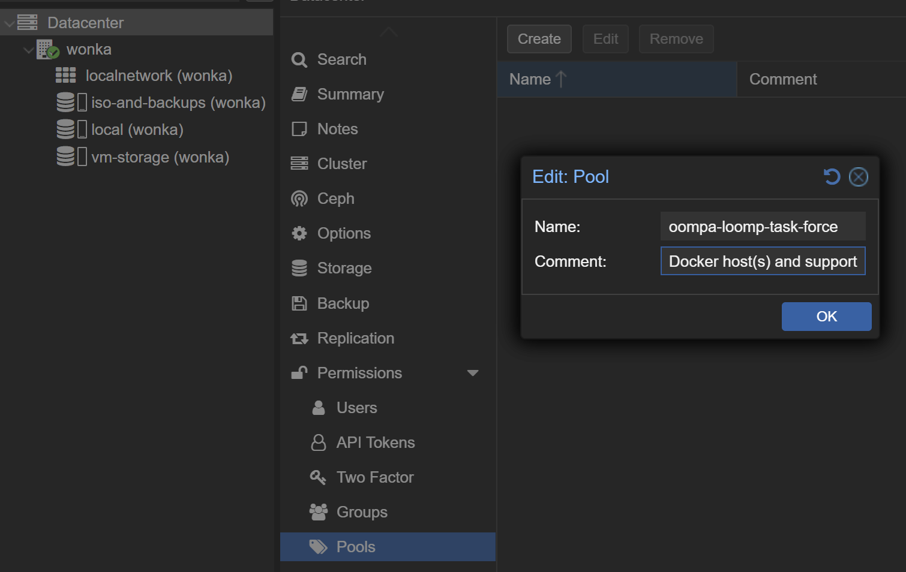
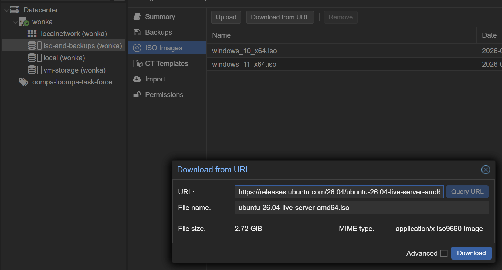
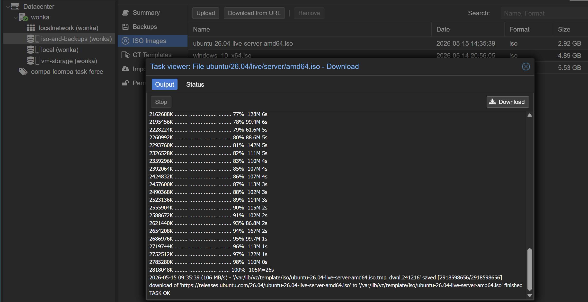
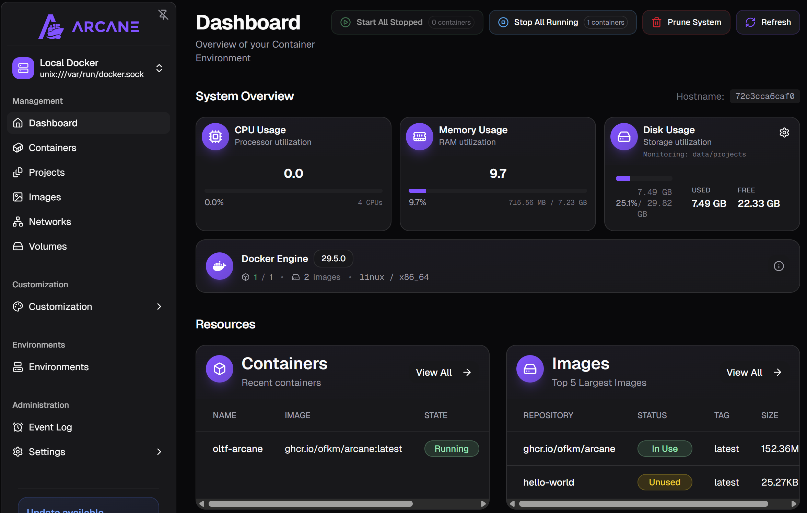

## Table of Contents

1. [Overview](#overview)
1. [Create Ubuntu Server VM in Proxmox (Docker Services VM)](#create-ubuntu-server-vm-in-proxmox-docker-services-vm)
    1. [Step 1: Create Proxmox Resource Pool](#step-1-create-proxmox-resource-pool)
    1. [Step 2: Download Ubuntu Server 26.04 LTS ISO](#step-2-download-ubuntu-server-2604-lts-iso)
    1. [Step 3: Create the Ubuntu Server VM](#step-3-create-the-ubuntu-server-vm)
    1. [Step 4: Boot and Install Server](#step-4-boot-and-install-server)
1. [Install Docker Engine on Ubuntu Server](#install-docker-engine-on-ubuntu-server)
    1. [What is Docker Engine?](#what-is-docker-engine)
    1. [Installing Docker Engine on Ubuntu Server](#installing-docker-engine-on-ubuntu-server)
1. [Starting Arcane Docker Management Service](#starting-arcane-docker-management-service)
    1. [What is Arcane?](#what-is-arcane)
    1. [Create docker-compose.yml in arcane folder](#create-docker-composeyml-in-arcane-folder)
    1. [Install and Start the Arcane Container](#install-and-start-the-arcane-container)
1. [References](#references)

## Overview

This writeup documents how I set up a dedicated Docker services environment on my Homelab Proxmox server. The goal is to have a single, well-organized virtual machine that runs Docker Engine for hosting containerized services, and Arcane (or something comparable) as a web-based Docker manager so I can deploy, monitor, and update those services from a browser instead of always SSHing into the host.
<br>
<br>
My Homelab theme is `The Chocolate Factory` and my Proxmox host is named `wonka`, and the VM that will run all the Docker containers is the `Oompa Loompa Task Force (OLTF)`. The OLTF lead VM is `oltf-hq`, and the Proxmox Resource Pool that groups all OLTF-related VMs and containers is named `oompa-loompa-task-force`. This naming makes the relationship clear at a glance: Wonka provides the infrastructure and the task force (OLTF) does the actual work.
<br>
<br>
By the end of this writeup, I'll have:
  - Proxmox Resource Pool grouping all `OLTF` resources
  - Ubuntu Server 26.04 LTS VM (`oltf-hq`) provisioned and running
  - Docker Engine installed via Docker's official APT repository
  - Arcane running as a Docker container, accessible from a browser, ready to manage additional services

## Create Ubuntu Server VM in Proxmox (Docker Services VM)

### Step 1: Create Proxmox Resource Pool

Proxmox Resource Pools are logical groupings of virtual machines (VMs) and containers (CTs) designed for organized management and delegated permissions, allowing administrators to manage multiple tenants or workloads efficiently. Created at the Datacenter level, they simplify access control by assigning user permissions to the entire pool. See [Proxmox forum thread](https://forum.proxmox.com/threads/resource-pool.159030/) for more.  
<br>
To create a new resource pool, follow these steps:  

  1. In proxmox, click `Datacenter` in the left tree.
  1. Click `Permissions -> Pools`
  1. Click `Create`
  1. Name the pool. (I'll be naming my pool the **oompa-loompa-task-force**)
  1. Add comments if you'd like, then click `OK`

*Naming the resource pool*


### Step 2: Download Ubuntu Server 26.04 LTS ISO 

**NOTE:** Proxmox can download ISOs directly to its local storage from a URL, which cuts out the middleman of saving the iso to your machine first, then uploading it to Proxmox. 
<br>
<br>
To download the Ubuntu Server 26.04 LTS ISO from URL, follow these steps:

1. In Proxmox, click you `main node's local storage`. (Mine is called **wonka**)
2. Click `ISO images`
3. Click `Download from URL
4. Enter the following URL: 
  ```sh
  https://releases.ubuntu.com/26.04/ubuntu-26.04-live-server-amd64.iso
  ```
5. Click `Query URL` (this will find and enter the image name), then `Download`

*Preparing to download Ubuntu Server image from URL*

<br>
*Ubuntu Server image successfully downloaded from URL*


### Step 3: Create the Ubuntu Server VM

1. Click `Create VM` at the top-right of the Proxmox UI.
2. I applied the following settings (some are in the advanced menu):
  ```
  General:
    - Node: `wonka`
    - VM ID: `100` (or accept the suggested next available)
    - Name: `oltf-hq`
    - Resource Pool: `oompa-loompa-task-force`
    - Start at boot: ✅
    - Click `Next`

  OS tab
    - Use CD/DVD disc image (iso): ✅
    - Storage: iso-and-backups
    - ISO image: select the Ubuntu 26.04 ISO you downloaded
    - Type: Linux
    - Version: 6.x - 2.6 Kernel
    - Click Next

  System tab
    - Machine: q35 (q35 is the modern chipset emulation)
    - BIOS: OVMF (UEFI)
    - Add EFI Disk: ✅
    - EFI Storage: vm-storage
    - Pre-Enroll keys: ❌
    - Qemu Agent: ✅
    - SCSI Controller: VirtIO SCSI single
    - Click Next

  Disks tab
    - Bus/Device: SCSI, 0
    - Storage: vm-storage
    - Disk size (GiB): 64
    - SSD emulation: ✅
    - Discard: ✅
    - Click Next

  CPU tab
    - Sockets: 1
    - Cores: 4
    - Type: host (passes through physical CPU's instruction set for max performance)
    - Click Next

  Memory tab
    - Memory (MiB): 8192
    - Ballooning Device: ✅
    - Click Next

  Network tab
    - Bridge: vmbr0
    - Model: VirtIO (paravirtualized)
    - Firewall: ✅
    - Click Next

  Confirm tab
    - Review your settings.
    - Uncheck Start after created (if you want to watch it boot for the first time)
    - Click Finish
  ```

### Step 4: Boot and Install Server

  ```
  1. Select the new Ubuntu Server VM in the Proxmox tree.
  2. Click `Start` at the top right.
  3. Click `Console` to see the remote console.
  4. At the GRUB boot menu, press `Enter` to select `Try or Install Ubuntu Server`
  5. Go through the installer steps (I used the defaults throughout).
  6. At storage configuration: Click `Done` and `Continue`
  7. Setup profile (username and password)
  8. Skip `Upgrade to Ubuntu Pro`
  9. Install SSH Server (skipped linking to GitHub)
  10. Skipped all Featured Snaps
  11. Wait for installer to complete, then click `Reboot Now` and `Enter`
  12. I had to "eject" the virtual CD after install to continue.
    - Click the VM tree in the proxmox web ui
    - Go to `Hardware`
    - Select `CD/DVD Drive (ide2)
    - Click `Edit`, change to `Do not use any media`
    - Cilck `OK`
  ```

```sh
# Successfully installed and accessed the Ubuntu Server 26.04 LTS
adminoompa@oltf-hq:~>
```

## Install Docker Engine on Ubuntu Server

### What is Docker Engine?

**Docker Engine** is the core open-source technology used to build, containerize, and run applications. It acts as a lightweight runtime that allows developers to package an application with all its dependencies into a single unit called a *container*, ensuring it runs consistently across different environments.
<br><br>
For more information, visit Docker Docs [HERE](https://docs.docker.com/engine/)

### Installing Docker Engine on Ubuntu Server

1. Download the Docker Engine installation script [HERE](https://get.docker.com/) or simply run the following command from your ubuntu server command line:

```sh
curl -fsSL https://get.docker.com -o install-docker.sh
```

Below is the Usage stated in the script:

```
# Usage
# ==============================================================================
#
# To install the latest stable versions of Docker CLI, Docker Engine, and their
# dependencies:
#
# 1. download the script
#
#   $ curl -fsSL https://get.docker.com -o install-docker.sh
#
# 2. verify the script's content
#
#   $ cat install-docker.sh
#
# 3. run the script with --dry-run to verify the steps it executes
#
#   $ sh install-docker.sh --dry-run
#
# 4. run the script either as root, or using sudo to perform the installation.
#
#   $ sudo sh install-docker.sh
```

2. Run the Docker Engine Installation Script:

```sh
sudo sh install-docker.sh
```

3. Once the script runs, you can `update, upgrade, and reboot`

```sh
sudo apt update && sudo apt upgrade -y
sudo reboot
```

4. Verify Docker daemon is active and running

```sh
systemctl is-active docker
active

or 

systemctl status docker
● docker.service - Docker Application Container Engine
     Loaded: loaded (/usr/lib/systemd/system/docker.service; enabled; preset: >
     Active: active (running) since Fri 2026-05-15 23:34:21 UTC; 22h ago
```

This verifies the Docker daemon is installed and active.
<br><br>
## Starting Arcane Docker Management Service

### What is Arcane?
Arcane is a self-hosted web dashboard for Docker. You point it at the Docker socket on your host (or a remote Docker API endpoint over TLS), and it gives you a browser UI to manage containers, images, networks, volumes, and Compose stacks. It runs as a single container itself.

### Create docker-compose.yml in arcane folder

1. Make /opt/arcane folder
    ```sh
    mkdir -p ~/arcane && cd ~/arcane`
    ```
2. Generate the two required secrets (save somewhere safe)
    ```sh
    echo "ENCRYPTION_KEY=$(openssl rand -hex 32)"
    echo "JWT_SECRET=$(openssl rand -hex 32)"
    ```
3. Create docker-compose.yml
    ```yml
    services:
      arcane:
        image: ghcr.io/ofkm/arcane:latest
        container_name: oltf-arcane
        restart: unless-stopped
        ports:
          - "3552:3552"
        environment:
          APP_URL: "http://YOUR.SERVER.IP:3552"
          PUID: "1000"
          PGID: "1000"
          ENCRYPTION_KEY: "PASTE_KEY_HERE"
          JWT_SECRET:     "PASTE_KEY_HERE"
        volumes:
          - /var/run/docker.sock:/var/run/docker.sock
          - ./data:/app/data
    ```

### Install and Start the Arcane Container
  ```sh
  adminoompa@oltf-hq:~/arcane$ sudo docker compose up -d
  [sudo: authenticate] Password:
  [+] up 11/11
  ✔ Image ghcr.io/ofkm/arcane:latest Pulled                                                   5.5s
  ✔ Network arcane_default           Created                                                  0.1s
  ✔ Container oltf-arcane            Started                                                  1.0s
  adminoompa@oltf-hq:~/arcane$
  ```

### Access Arcane From Your Browser

1. Access your new Arcane UI from your browser: `http://YOUR.SERVER.IP:3552`
2. First log on username: `arcane`
3. First log on password: `arcane-admin`
4. Update your password

That's it!

*Screenshot of first Arcane access*


## References

1. [Ubuntu Server 26.04 LTS Download Link](https://ubuntu.com/download/server/thank-you?version=26.04&architecture=amd64&lts=true)
1. [Proxmox Resource Pool Info](https://forum.proxmox.com/threads/resource-pool.159030/)
1. [Docker Docs](https://docs.docker.com/engine/)
1. [Docker Engine YouTube Reference](https://www.youtube.com/watch?v=YeF7ObTnDwc&t=427s)
1. [Docker Engine Install from Docker Docs](https://docs.docker.com/engine/install/ubuntu/)
1. [Arcane Documentation](https://getarcane.app/)