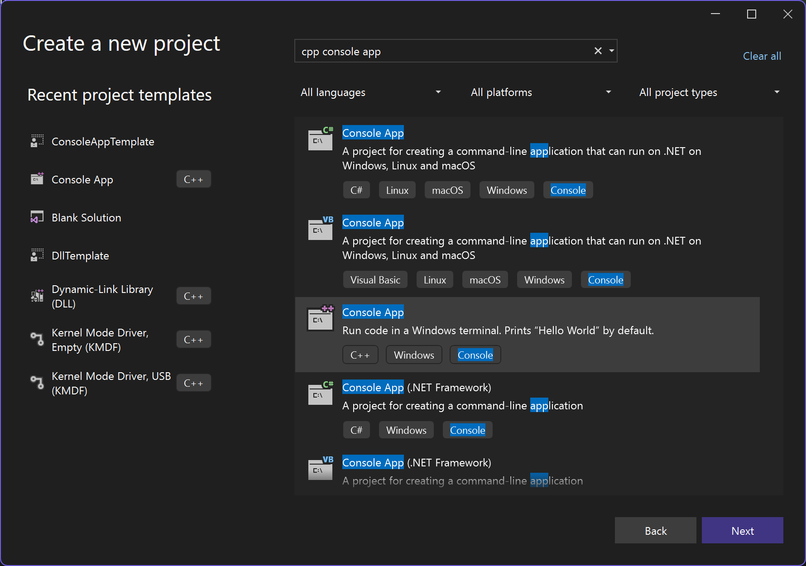
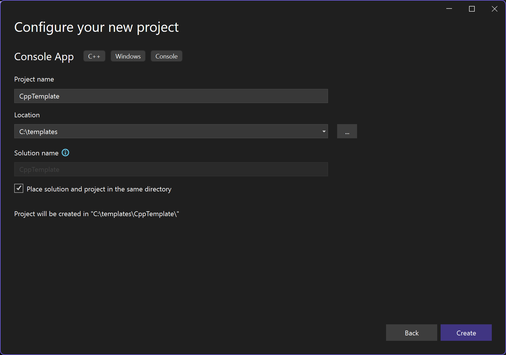
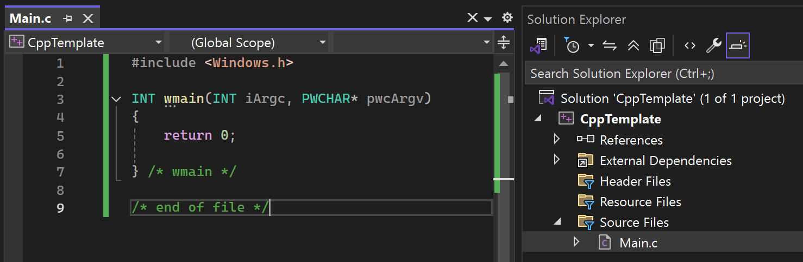
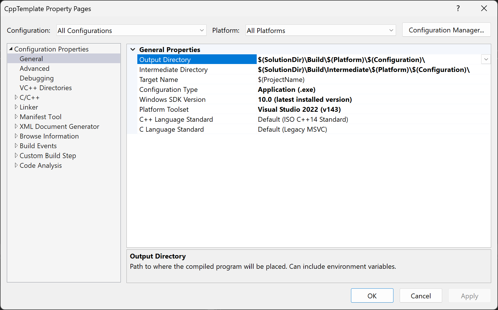
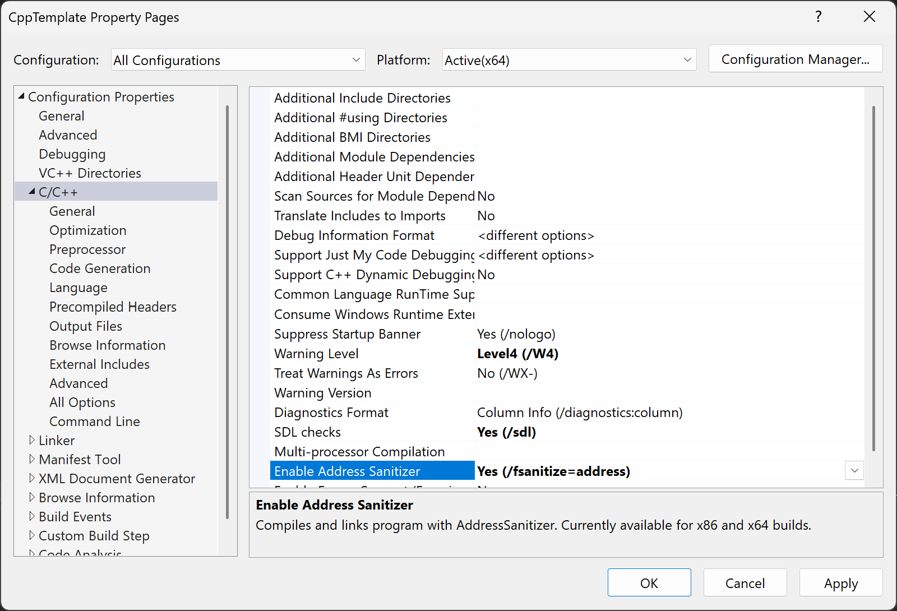
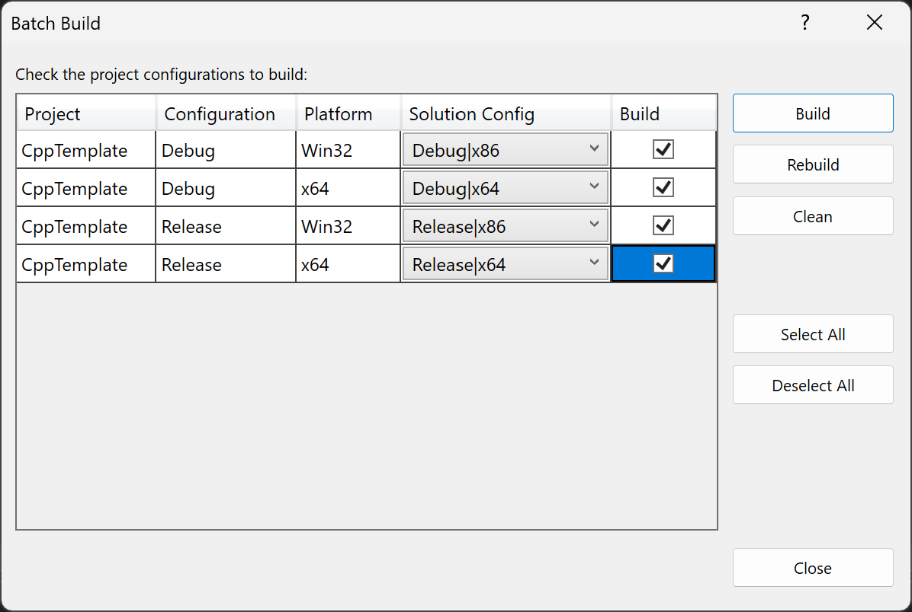
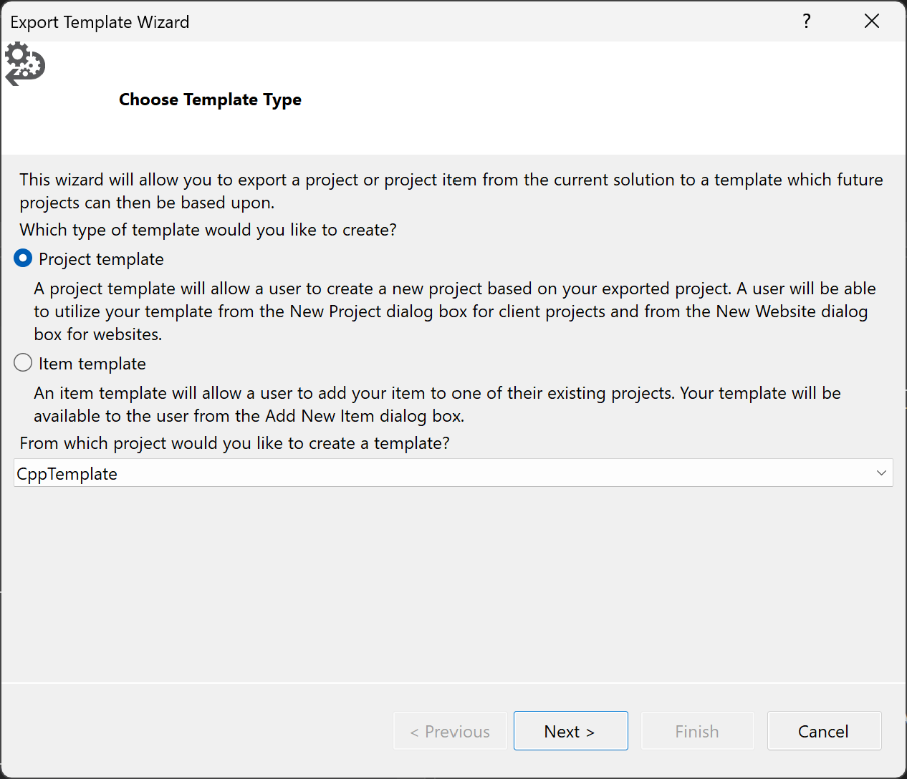
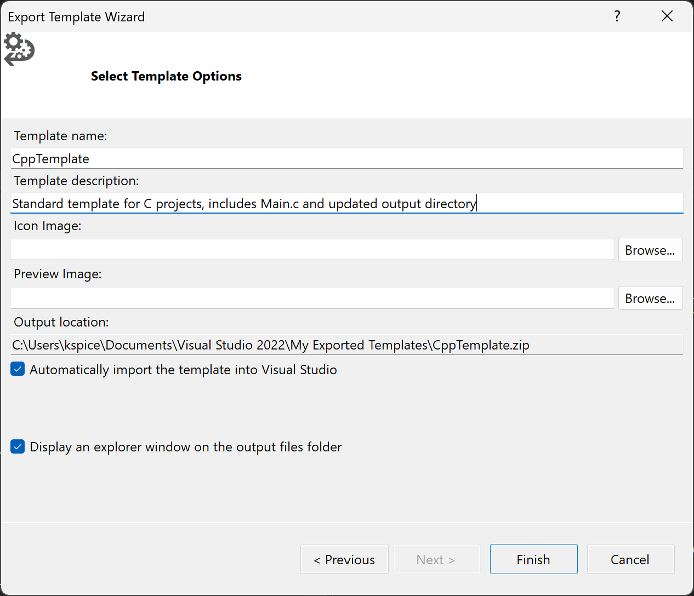
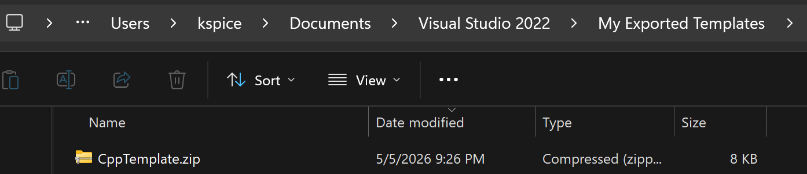
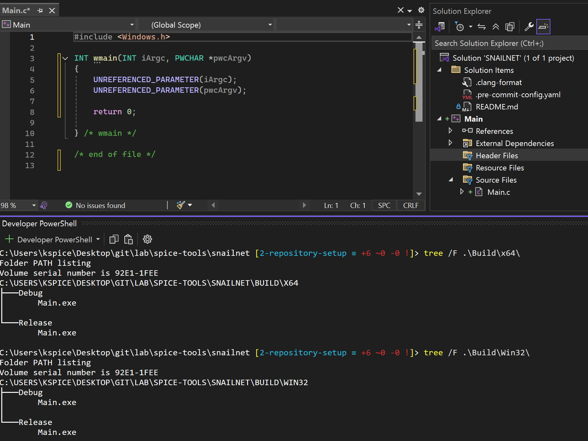

# Visual Studio Template from Configured C/C++ Console App

Date Created: 05-05-2026

## Overview

The purpose of this writeup is to document how I configure a C project and generate a reusable template for future projects. This tutorial will go over creating a C/Cpp Console App, adjusting default settings for better work flow, test building project, and finally exporting the skeleton project to a Visual Studio template for repeated use.

## Table of Contents

1. [Create a new C/C++ console app](#create-a-new-cc-console-app)
1. [Adjust Project Settings](#adjust-project-settings)
    - [Add Main.c and sample source code](#add-mainc-and-sample-source-code)
    - [Update Default Output and Intermediate Directories](#update-default-output-and-intermediate-directories)
    - [Add Build Hardening with Warning Level 4 and Address Sanitizer](#add-build-hardening-with-warning-level-4-and-address-sanitizer)
    - [Conduct a Test Build](#conduct-a-test-build)
1. [Export as a Visual Studio template](#export-as-a-visual-studio-template)
1. [Using the template](#using-the-template)

## System Requirements

- IDE Version: Microsoft Visual Studio 2022 Version 17.14.14.
- OS Version: Windows 11 Pro  

## Create a new C/C++ console app

Below are the steps to create a new Visual Studio C/C++ console app:

1. Open Visual Studio IDE
2. Select **Create New Project**
3. Search for `cpp console app` and select the proper project, then click **Next**.
    
4. Configure the Template Project Settings, the click **Create**
    
5. Visual Studio IDE will then open your default `CppTemplate` project with the generic `Hello World` written in Cpp.

## Adjust Project Settings

### Add Main.c and sample source code

1. Rename `CppTemplate.c` file to `Main.c`
2. Replace the contents of the new `Main.c` with the following code: 
    ```c
    #include <Windows.h>

    INT wmain(INT iArgc, PWCHAR* pwcArgv)
    {
        UNREFERENCED_PARAMETER(iArgc);
        UNREFERENCED_PARAMETER(pwcArgv);
        
        return 0;

    } /* wmain */

    /* end of file */
    ```

3. Your project should look similar to the following image:
    

### Update Default Output and Intermediate Directories

By default, when Visual Studio builds your programs, the x64|x86 directories are created separately and placed next to the project settings files. Once you expand your project to include multiple static libraries, etc., the generated files are scattered all throughout your repository. I prefer to alter two project settings (Output Directory, Intermediate Directory) placing all generated build files into the same path for easy use and cleanup.

1. Navigate to the Solution Explorer and right click `CppTemplate` project.
1. Click `properties`
1. Ensure `All Configurations and All Platforms` are selected, if this is your preference.
1. Update `Configuration Properties > General > Output Directory` to the following
    
    ```c
    $(SolutionDir)\Build\$(Platform)\$(Configuration)\
    ```
1. Update `Configuration Properties > General > Intermediate Directory` to the following: 
    
    ```c
    $(SolutionDir)\Build\Intermediate\$(Platform)\$(Configuration)\
    ```

1. Click `Apply` and now you project will place all build artifacts in a single folder and subfolder for easy use later on.



### Add Build Hardening with Warning Level 4 and Address Sanitizer

1. Right click the `CppTemplate` project and select `properties`
1. Ensure `All Configurations and All Platforms` are selected
1. Update `Configuration Properties > C/C++ > Warning Level` to `Warning Level 4`
1. Update `Configuration Properties > C/C++ > Enable Address Saniter` to `Yes (/fsanitize=address)`
1. Select `Apply` to save the settings



### Conduct a Test Build

Once you are content with the updates, I like to run a test build of all configurations [x64|x86|DEBUG|RELEASE] to ensure everything builds without warnings/errors. To build all configurations in one easy step, you can use the `Batch Build` feature in Visual Studio. 

1. Navigate to the `Build > Batch Build` and select all configurations you would like to test build.
1. Then select `Build`



1. The Batch Build job will build all selected versions of your project and place them in the proper output and intermediate directories. In this case, all generated files will be places in the `$SolutionDir > Build` path.

1. Open a terminal inside the Visual Studio IDE through `View > Terminal` and a VS Developer Terminal will open in the current working directory.

1. Ensure your `Build` and `Build/Intermediate` folders were created and contain the proper files.

```powershell
C:\templates\CppTemplate> tree /F .\Build\x64\
Folder PATH listing
Volume serial number is 92E1-1FEE

C:\TEMPLATES\CPPTEMPLATE\BUILD\X64
├───Debug
│       CppTemplate.exe
│       CppTemplate.pdb
│
└───Release
        CppTemplate.exe

C:\templates\CppTemplate> tree /F .\Build\Win32\
Folder PATH listing
Volume serial number is 92E1-1FEE
C:\TEMPLATES\CPPTEMPLATE\BUILD\WIN32
├───Debug
│       CppTemplate.exe
│       CppTemplate.pdb
│
└───Release
        CppTemplate.exe
```

## Export as a Visual Studio template

Once you are happy with the outcome, follow these steps to turn a VS project into a template.

1. On the top VS tool bar select `Project > Export Template`
1. Select `Project Template` and ensure the correct project is selected, then select `Next`.



1. Add personalization settings and keep the default paths / options. Visual Studio will know where to find your templates and load them each time for easy access.



1. Select `Finish` to create the template.
1. Verify your template.zip was created and placed in the proper folder.



## Using the template

To use your template, follow these steps:

1. Create a new Visual Studio Solution in a new directory.
1. Right click > Add > New Project
1. You will see the `CppTemplate` project preloaded.
1. Select `CppTemplate`, then `Next`
1. Give your project a name, ensure the path is correct, and select `Create`

Now you have a new project with all of your template configurations ready to use. To test, you can simple build your project to verify all repository shortcut links work properly in the new location.

There may be some additional settings you wish to adjust, but this should get you pointed in the right direction.

