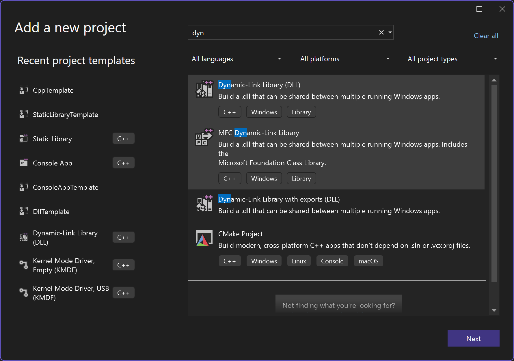
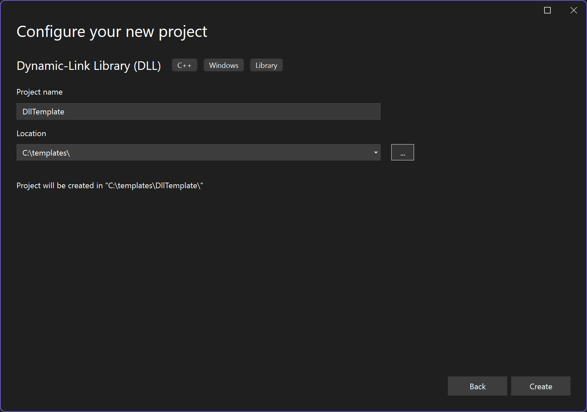
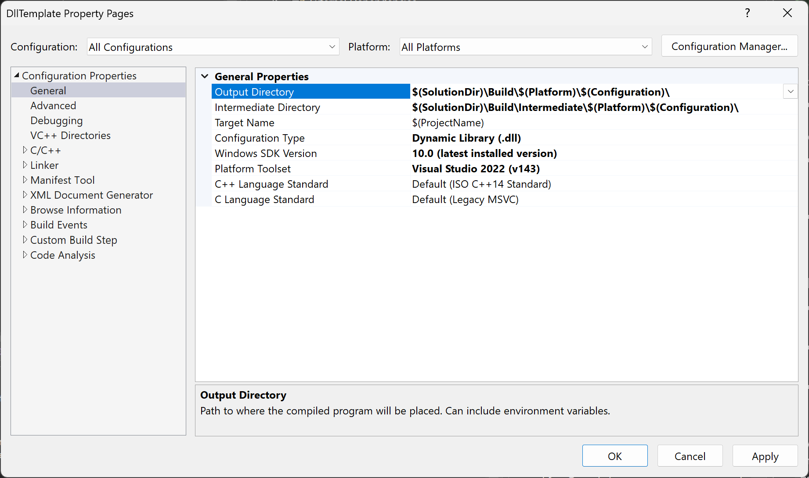
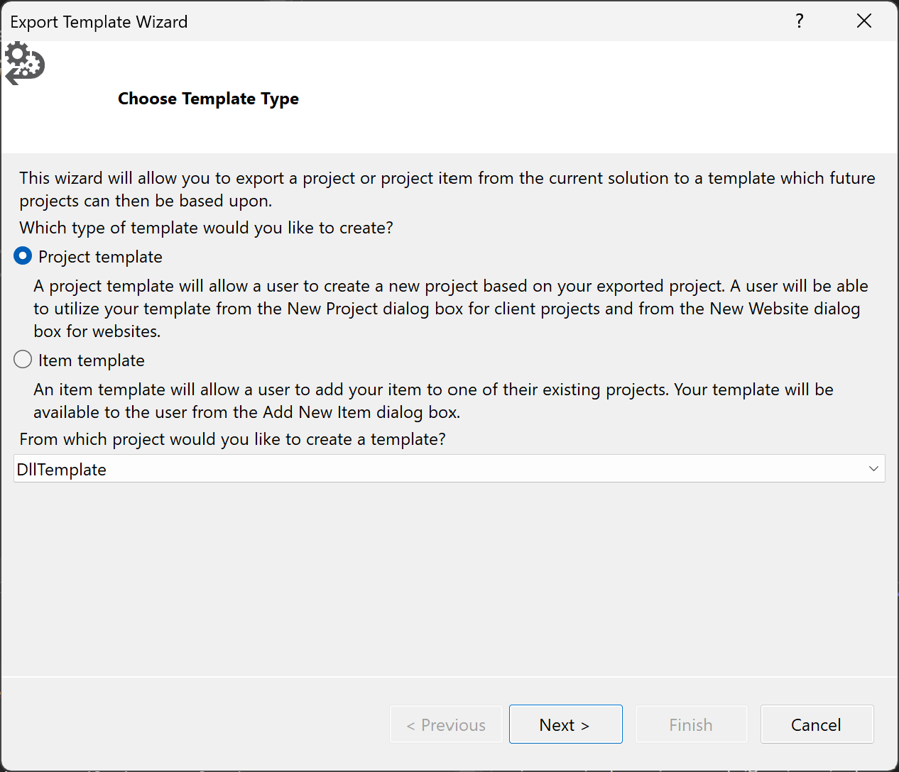
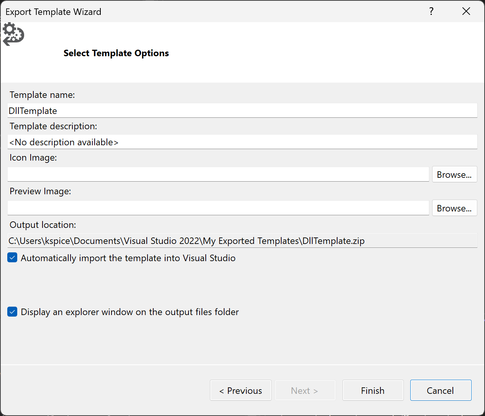
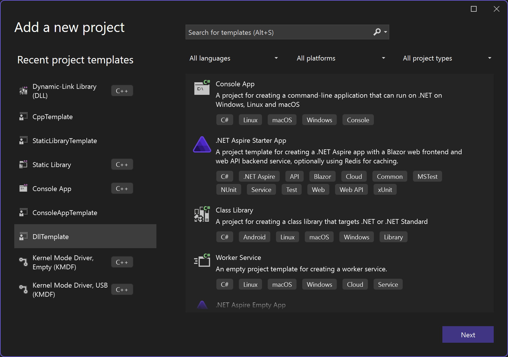

# Visual Studio Template from Configured Dynamic Link Library

Date Created: 05-09-2026

## Overview

The purpose of this writeup is to document how I configure a Visual Studio Dynamic Link Library project and generate a reusable template for future projects. This tutorial covers creating a Dynamic Link Library project, adjusting default settings for better workflow, test-building the project, and exporting it as a Visual Studio template for repeat use.

**Please Note:** I create all of my Visual Studio templates for C language development.

## Table of Contents

1. [Create a New Dynamic Link Library Project](#create-a-new-dynamic-link-library-project)
1. [Adjust Default Settings](#adjust-default-settings)
    1. [Update Output and Intermediate Directory Paths](#update-output-and-intermediate-directory-paths)
    1. [Update Project Settings](#update-project-settings)
    1. [Remove Precompiled Headers and Extras](#remove-precompiled-headers-and-extras)
1. [Export as Visual Studio Template](#export-as-visual-studio-template)
1. [Download the exact template](#download-the-exact-template)

## Create a New Dynamic Link Library Project

1. Open Visual Studio and create a new project.
1. Search for and select `Dynamic-Link Library (DLL)`.
1. Click `Next`, configure the project name/path, then click `Create`.





## Adjust Default Settings

### Update Output and Intermediate Directory Paths

By default, Visual Studio places build artifacts in directories beside project files. I prefer centralizing generated files under a `Build` path for easier cleanup and consistency across projects.

1. Right click the DLL project in Solution Explorer and select `Properties`.
1. Ensure `All Configurations` and `All Platforms` are selected.
1. Update `Configuration Properties > General > Output Directory` to:

```c
$(SolutionDir)\Build\$(Platform)\$(Configuration)\
```

1. Update `Configuration Properties > General > Intermediate Directory` to:

```c
$(SolutionDir)\Build\Intermediate\$(Platform)\$(Configuration)\
```



### Update Project Settings

1. **Code hardening — C/C++ General**
    1. In project `Properties`, go to `Configuration Properties > C/C++ > General`.
    1. Set `Warning Level` to `Level 4 (/W4)`.
    1. Set `Enable Address Sanitizer` to `Yes (/fsanitize=address)` if it aligns with your environment and toolchain.
1. **Precompiled headers**
    1. Go to `Configuration Properties > C/C++ > Precompiled Headers`.
    1. Set `Precompiled Header` to `Not Using Precompiled Headers`.
    1. Clear `Precompiled Header File` if it still references `pch.h`, then click `Apply`.
1. **CRT static linking (Debug)**
    - **PLEASE NOTE:** I statically link the CRT by default for testing across Windows versions; skip if you prefer dynamic CRT (`/MDd`).
    1. Set the configuration dropdown to `Debug` and platform to what you support (for example `All Platforms`).
    1. Go to `Configuration Properties > C/C++ > Code Generation`.
    1. Set `Runtime Library` to `Multi-threaded Debug (/MTd)`.
    1. Click `Apply`.
1. **CRT static linking (Release)**
    - **PLEASE NOTE:** Same as Debug; skip if you prefer `/MD`.
    1. Set the configuration dropdown to `Release`.
    1. Go to `Configuration Properties > C/C++ > Code Generation`.
    1. Set `Runtime Library` to `Multi-threaded (/MT)`.
    1. Click `Apply`.
1. **No PDB output for Release (optional)**
    - **PLEASE NOTE:** Turning off linker debug info means Release binaries won’t ship with PDBs — useful only if that matches how you distribute DLLs.
    1. Set the configuration dropdown to `Release`.
    1. Go to `Configuration Properties > Linker > Debugging`.
    1. Set `Generate Debug Info` to `No`.
    1. Click `Apply`.

### Remove Precompiled Headers and Extras

1. Remove and Delete default files: `pch.h, pch.cpp, and framework.h`
1. Change `dllmain.cpp` to `dllmain.c`
1. Paste the following source code into `dllmain.c`

```c
#include <Windows.h>

BOOL APIENTRY DllMain( HMODULE hModule,
                       DWORD  ul_reason_for_call,
                       LPVOID lpReserved
                     )
{
    UNREFERENCED_PARAMETER(lpReserved);
    UNREFERENCED_PARAMETER(hModule);

    switch (ul_reason_for_call)
    {
    case DLL_PROCESS_ATTACH:
    case DLL_THREAD_ATTACH:
    case DLL_THREAD_DETACH:
    case DLL_PROCESS_DETACH:
        break;
    }
    return TRUE;
}

/* end of file */
```

Run a **test build** for **Debug** and **Release** (and each platform you care about) so the project builds without warnings or errors before you export the template.

## Export as Visual Studio Template

1. From the top menu, select `Project > Export Template`.
1. Select `Project Template`, ensure the DLL project is selected, then click `Next`.
1. Add template metadata and click `Finish`.




1. After exporting, the template is available when creating new projects.



## Download the exact template

If you would like to use the exact templates from this series, you can download them from my GitLab repository:
[Download here](https://gitlab.com/kspice-dev/dev-resources/-/tree/main/templates/visual-studio?ref_type=heads)
