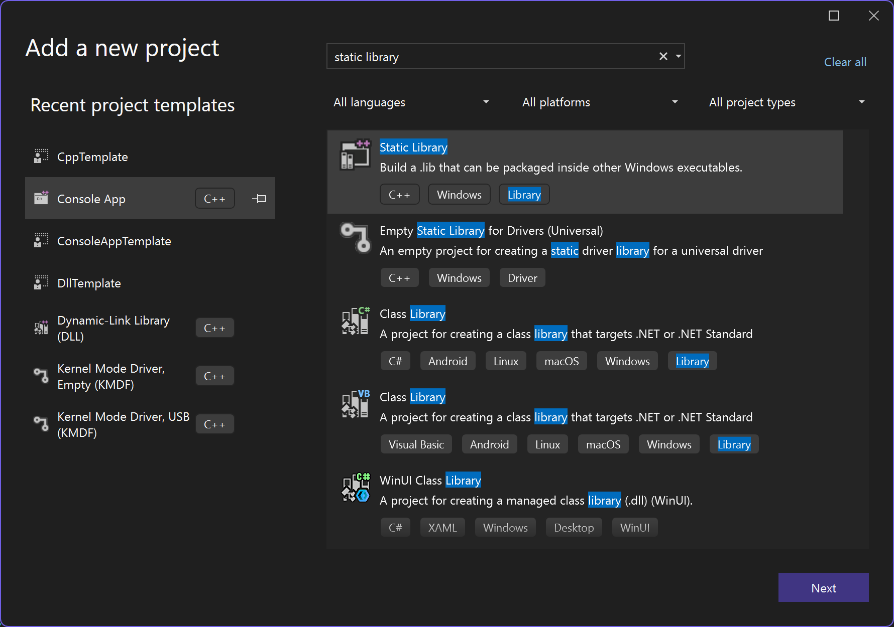
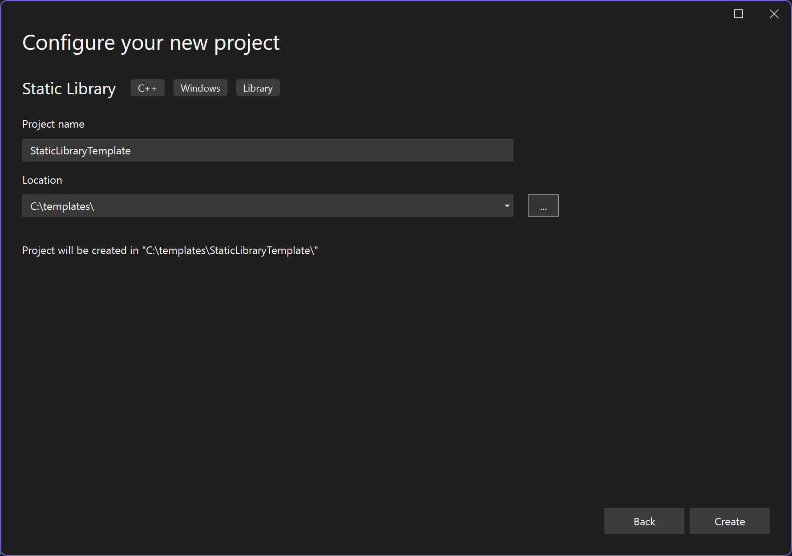
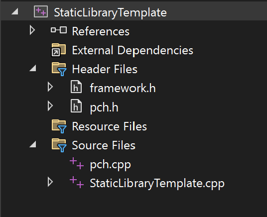
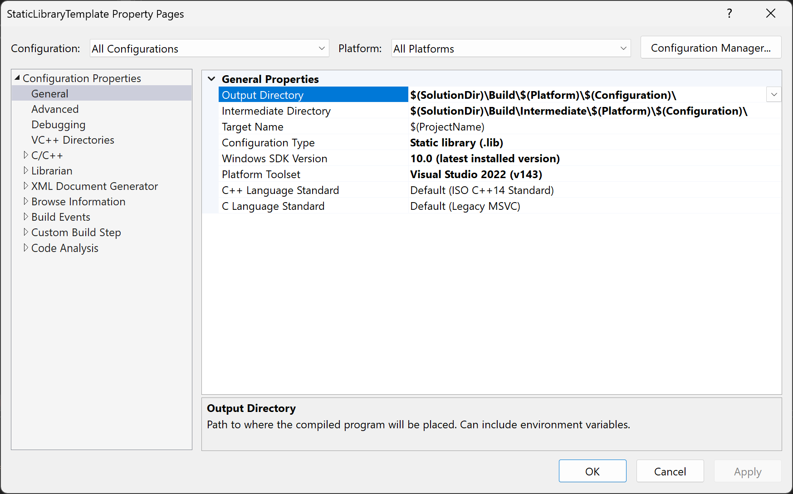
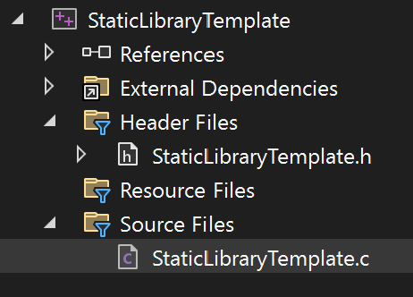
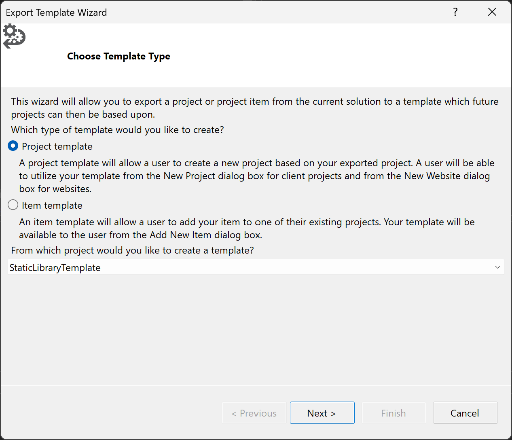
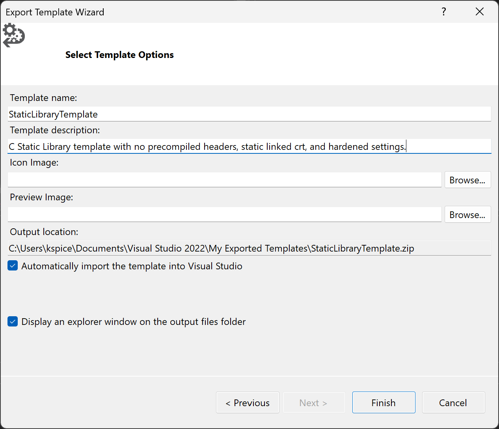
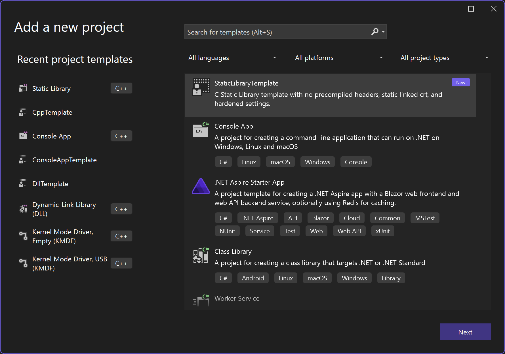

# Visual Studio Template from Configured Static Library

Date Created: 05-07-2026

## Overview

The purpose of this writeup is to document how I configure a Visual Studio Static Library project and generate a reusable template for future projects. This tutorial will cover creating a Static Library, adjusting default settings for better work flow, test building project, and finally exporting the skeleton project to a Visual Studio template for repeated use.

## Table of Contents

1. [Create a New Static Library Project](#create-a-new-static-library-project)
1. [Adjust Default Settings](#adjust-default-settings)
    1. [Update Output and Intermediate Directory Paths](#update-output-and-intermediate-directory-paths)
    1. [Remove Precompiled Header and Other Files](#remove-precompiled-header-and-other-files)
    1. [Update Project Settings](#update-project-settings)
1. [Export as Visual Studio Template](#export-as-visual-studio-template)

## Create a New Static Library Project

1. Open Visual Studio > New Project
1. Search and Select `Static Library`
1. Click `Next` to create a new Static Library project



1. Name the template and enter the folder where you would like to store the template project.



1. Click `Create` to create the Visual Studio project.

Below is an image of the default static library configuration.



## Adjust Default Settings

There are a few default settings we will be removing/altering to cleanup our base static library template, this includes:

1. [Update Output and Intermediate Directory Paths](#update-output-and-intermediate-directory-paths)
1. [Remove Precompiled Header and Other Files](#remove-precompiled-header-and-other-files)
1. [Update Project Settings](#update-project-settings)

### Update Output and Intermediate Directory Paths

By default, when Visual Studio builds your programs, the x64|x86 directories are created separately and placed next to the project settings files. Once you expand your project to include multiple static libraries, etc., the generated files are scattered all throughout your repository. I prefer to alter two project settings (Output Directory, Intermediate Directory) placing all generated build files into the same path for easy use and cleanup.

1. Navigate to the Solution Explorer and right click `StaticLibraryTemplate` project.
1. Click `properties`
1. Ensure `All Configurations and All Platforms` are selected, if this is your preference.
1. Update `Configuration Properties > General > Output Directory` to the following
    
    ```c
    $(SolutionDir)\Build\$(Platform)\$(Configuration)\
    ```
1. Update `Configuration Properties > General > Intermediate Directory` to the following: 
    
    ```c
    $(SolutionDir)\Build\Intermediate\$(Platform)\$(Configuration)\
    ```



1. Click `Apply` and now you project will place all build artifacts in a single folder and subfolder for easy use later on.

### Remove Precompiled Header and Other Files

The default static library template comes with the following files: `framework.h`, `pch.h`, `pch.cpp` and `StaticLibraryTemplate.cpp`. I configure my project for C program development and remove excess files.

1. Delete `pch.h` and `pch.cpp`. 
    - Right click each file name, select `remove`, then `delete`.
1. Rename `framework.h` to `StaticLibraryTemplate.h` 
    - Update the contents of `StaticLibraryTemplate.h` to the following: 
    ```c
    #pragma once

    #define WIN32_LEAN_AND_MEAN

    #include <Windows.h>

    /* end of file */
    ```

1. Rename `StaticLibraryTemplate.cpp` to `StaticLibraryTemplate.c`
    - I replace the contents of `StaticLibraryTemplate.c` to the following:
    ```c
    #include <Windows.h>

    #include "StaticLibraryTemplate.h"

    /* end of file */
    ```

Your template project should now look like this:



### Update Project Settings

Finally, we will step through the default project settings to harden our warning levels, add address sanitizer, make static linking our default, and remove excess functionality not needed for this template.

1. Right click `StaticLibraryTemplate` and select `Properties`
1. Ensure `All Configurations` and `All Platforms` are selected.
1. Harden Default Coding Standards 
    - Goto `Configuration Properties > C/C++ > General` 
    - Change `Warning Level` to `4`
    - Change `Enable Address Sanitizer` to `Yes (/fsanitize=address)`
    - Click `Apply`
1. Adjust Precompiled Headers Settings
    - Goto `Configuration Properties > C/C++ > Precompiled Headers`
    - Change `Precompiled Header` to `Not Using Precompiled Headers`
    - Remove `pch.h` from the `Precompiled Header File`
    - Click `Apply`
1. Change Debug Build from Dynamic to Static Linking of CRT
    - Change `All Configurations` to `Debug`
    - Goto `Configuration Properties > C/C++ > Code Generation`
    - Change `Runtime Library` from `Multi-threaded Debug DLL (/MDd)` to `Multi-threaded Debug (/MTd)`
    - Click `Apply`
    - This will statically link CRT during Debug builds of this static library by default.
1. Change Release Build from Dynamic to Static Linking of CRT
    - Change `All Configurations` to `Release`
    - Goto `Configuration Properties > C/C++ > Code Generation`
    - Change `Runtime Library` from `Multi-threaded DLL (/MD)` to `Multi-threaded (/MT)`
    - Click `Apply`
    - This will statically link CRT during Release builds of this static library by default.
1. Perform a test build to ensure everything builds without warnings/errors.

## Export as Visual Studio Template

Once you are content with the updated static library project and you are ready to templatize, follow these steps:

1. On the top VS tool bar select `Project > Export Template`
1. Select `Project Template` and ensure the correct project is selected, then select `Next`.



1. Select `Project Template` and ensure your static library template is selected.
1. Personalize settings and select `Finish` to create your template.



1. Once exported, you will be able to create new static libraries from your template with your exact custom settings.

